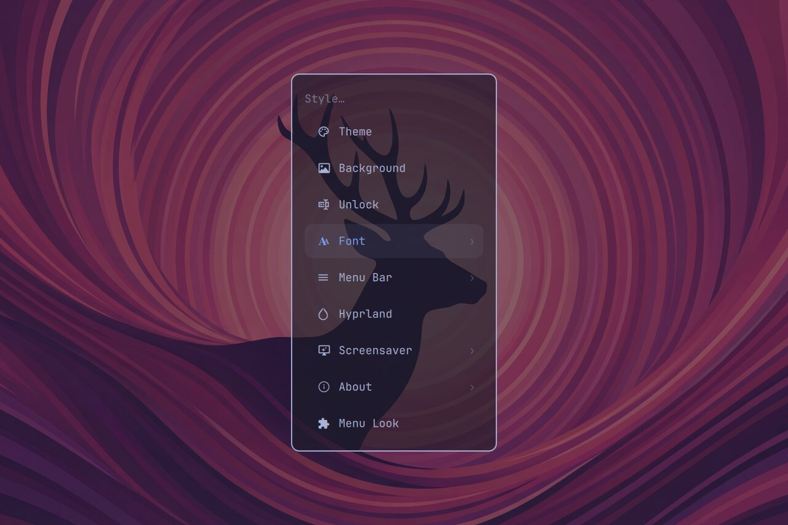
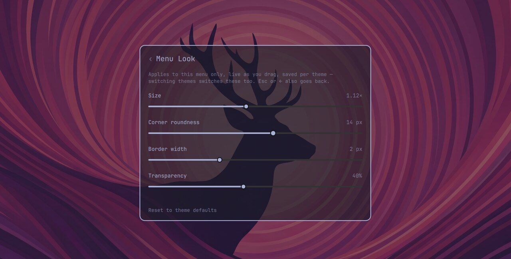
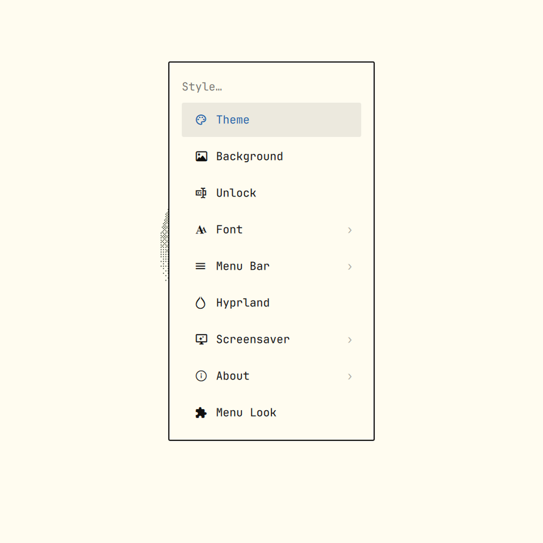

# Omarchy menu + Menu Look

The stock [Omarchy](https://omarchy.org/) command menu (`SUPER + SPACE`), with
one thing added: a **Menu Look** row under Style that resizes this menu, rounds
its corners, sets its border width and its transparency — live, as you drag —
**saved per theme**, and without touching the bar, panels, or anything else.



The **Menu Look** editor — every knob previews on the menu itself as you drag:



Untouched, it's the built-in menu exactly — just with one extra row:



## Is this for you?

- The menu feels a touch small (or large) for your monitor and you want it a
  little bigger without scaling the whole shell up.
- You run a light theme and a dark theme and want the menu shaped slightly
  differently in each.
- You just want rounder corners, a thicker outline, or a see-through menu.

If not, this is a faithful clone of the built-in menu — installing it changes
nothing until you touch a slider.

## Why it's a menu clone, not a normal plugin

The menu's corner radius, font size and border width all come from the shell's
**global** style tokens (`Style.cornerRadius`, `Style.font.*`, …) — the same
ones the bar and every panel read. Nothing lets a plugin restyle *only* the
menu from the outside. The supported way to get menu-only controls is to own
the menu: `omarchy plugin clone omarchy.menu`, which is what this is.

That means `Menu.qml` is a fork. The diff against the built-in menu is kept
small and to a few clearly marked seams (see *What's changed* below) so
re-merging upstream changes after an `omarchy update` stays easy. `MenuModel.js`
and `BarWidget.qml` are byte-for-byte the built-in menu.

## Requirements

- **Omarchy 4** with its Quickshell-based shell.
- **`python3`** — used for the bounded, `O_NOFOLLOW` read and write of this
  plugin's own small state file (see *Notes for reviewers*). Present on a
  normal Omarchy install.

No network. No elevated privileges. No packages.

## Install

```bash
omarchy plugin add https://github.com/Deunnis/OmaMenu.git --enable
omarchy restart shell
```

Enabling it replaces the built-in menu; the `SUPER + SPACE` binding and every
`omarchy.menu` IPC call route here automatically (that's what `clonedFrom` in
the manifest does).

## Use

Open the menu → **Style → Menu Look**. Drag a slider and the menu restyles
instantly:

| Knob | Range | Default |
|---|---|---|
| Size | 0.8×–1.5× | 1.0× |
| Corner roundness | 0–24 px | the theme's `decoration:rounding` |
| Border width | 0–6 px | the theme's menu border width |
| Transparency | 0–90 % | 0 % (opaque) |

- **Per theme.** Every theme keeps its own four values. Switch themes
  (`omarchy theme set`, the picker, a rotator like OmaShuffle) and Menu Look
  switches with it, live — a theme you've never touched just renders with the
  defaults above.
- **Back:** the `‹` at the top of the editor, or `Esc` / `←`.
- **Reset to theme defaults** clears *this* theme's four values back to
  "inherit from the shell theme" and leaves every other theme's alone.

## Where it keeps things

One file: `~/.local/state/omarchy/io.github.omamenu/style.json`, a small JSON object
keyed by theme slug:

```json
{
  "tokyo-night": { "scale": 1.15, "cornerRadius": 14, "borderWidth": 2, "transparency": 15 },
  "rose-pine":   { "scale": 1.0,  "cornerRadius": -1, "borderWidth": -1, "transparency": 0 }
}
```

`-1` means "inherit from the theme". Delete the file for a clean slate; nothing
else is stored anywhere.

## What's changed vs. the built-in menu

All in `Menu.qml`, at marked seams:

- `cornerRadius` and the card's border width now read the effective
  (config-or-inherit) value instead of `Style.*` directly.
- The card gets a `scale` transform and a background-alpha override for the
  Size and Transparency knobs.
- A `kind: "action"` **Menu Look** row is injected under Style and intercepted
  in `activateIndex()` to open `MenuLookEditor.qml` in place of the row list;
  `Esc` / `←` in that view route to `goBack()`.
- Bounded-reader / bounded-writer `Process` helpers for `style.json` and the
  active-theme name, plus one `FileView` used purely as a change notifier for
  the theme name.

`MenuLookEditor.qml` is the only new UI file. `MenuModel.js` and
`BarWidget.qml` are unchanged.

## Notes for reviewers

- **No network, no privileged calls, installs nothing.** The only subprocesses
  are `timeout … python3 -c` helpers for reading and writing this plugin's own
  state file.
- **Every file read goes through a descriptor-pinned, byte-capped, deadlined
  helper** — never a `FileView.text()`. `style.json` and
  `~/.local/state/omarchy/current/theme.name` both live under `~/.local/state`
  where another local process could plant a symlink, a FIFO, or an oversized
  file first. Each read: `timeout -k 2 5` bounds wall time,
  `O_RDONLY | O_NOFOLLOW | O_NONBLOCK` refuses a symlink and never blocks on a
  FIFO, an `fstat` on that descriptor requires a regular file, and the read
  stops at `limit + 1` bytes (64 KiB for `style.json`, 256 for the theme name).
- **The write helper** creates the state dir then re-checks it is a real
  directory owned by this uid (not a symlink swap), refuses to proceed if the
  target already exists as anything but a regular file, and lands the payload
  through an `O_EXCL` `mkstemp` in that same directory followed by
  `os.replace()` — which renames the link itself and never writes through it.
- **The theme name** is only ever used as a JSON object key; it's
  `^[a-z0-9][a-z0-9._-]*$`-validated and length-capped before use.
- **Nothing global is written.** No `shell.toml`, no Hyprland config, no theme
  files — only `~/.local/state/omarchy/io.github.omamenu/style.json`.
- **The rest of the menu is unmodified `omarchy.menu`.** `finishRequest()` (the
  select/dmenu result-file writer), the provider and guard `bash -lc` helpers,
  and the JSONC menu-file `FileView`s are byte-for-byte the built-in menu — run
  `diff` against `$OMARCHY_PATH/shell/plugins/menu/`. This is a `clonedFrom`
  plugin; those paths are Omarchy's, not introduced here.

## Known limitations

- The sliders are pointer-driven; there's no keyboard focus/Tab navigation
  *inside* the editor (the rest of the menu is unchanged). `Esc` / `←` / the
  `‹` get you back out.
- Size is a render-scale transform on the menu card. At the top of the range on
  a very short display the card can run past the screen edge; dial it back or
  the menu will clamp.

## Remove

```bash
omarchy plugin remove io.github.omamenu
omarchy restart shell
```

The built-in menu takes over again automatically. Delete
`~/.local/state/omarchy/io.github.omamenu/` to clear the saved per-theme looks.

## Development

```bash
omarchy plugin validate ~/.config/omarchy/plugins/io.github.omamenu
/usr/lib/qt6/bin/qmllint -I /usr/lib/qt6/qml -I /usr/share/omarchy/shell \
  Menu.qml MenuLookEditor.qml            # import/unqualified warnings only
omarchy restart shell                     # plugin QML is cached by URL — a
                                          # save-triggered hot reload does not
                                          # pick up JS-logic changes
```

## License

MIT — see [LICENSE](LICENSE).
